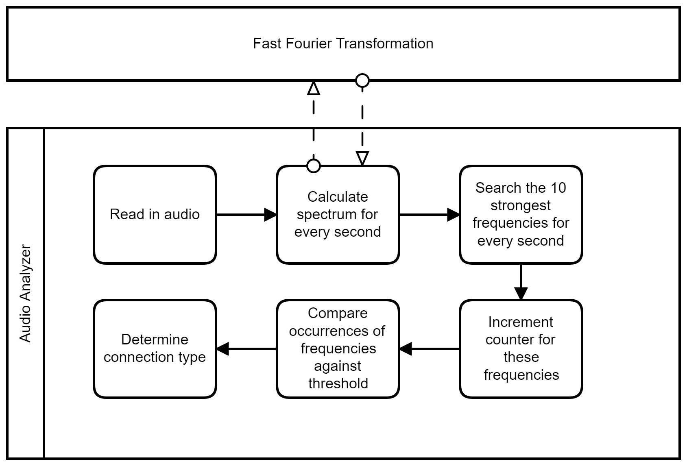

# swd - simple wardialer

`swd` is a simple command line wardialer for identifying modems and can dial multiple phone numbers in parallel via VoIP. `swd` differentiates between modem, fax or other devices and saves all the information in an SQLite database.

## Table of Contents

* [Getting Started](#getting-started)
  * [Prerequisites](#prerequisites)
  * [Build Process](#build-process)
* [Usage](#usage)
  * [Logging](#logging)
  * [Database](#database)
  * [Troubleshooting](#troubleshooting)
* [Structure](#structure)
* [License](#license)
* [Contact](#contact)

## Getting Started

### Prerequisites

In order to build `swd` you need the following libraries:

* `boost_program_options`
* `osip2`
* `eXosip2`
* `kissfft`
* `ortp`
* `bctoolbox`
* `math`
* `sqlite3`
* `pthread`

### Developer Prerequisites

* To run `make test` you need to install `cxxtest`
* To run `make check` you need `cpplint`.

#### Preferred: Debian 10 (Buster)

1. You can install most of the required libraries (except `kissfft`) with the following command:     

        sudo apt install libosip2-dev libboost-program-options-dev libortp-dev libsqlite3-dev libexosip2-dev

2. Install `kissfft`:

       git clone https://github.com/mborgerding/kissfft.git
       cd kissfft
       make
       sudo make install

#### Kali Linux 2020.3 / Ubuntu 20.04

1. You can install most of the required libraries (except `kissfft` and `libexosip2-dev`) with the following command:     

        sudo apt install libosip2-dev libboost-program-options-dev libortp-dev libsqlite3-dev

2. Install `kissfft`:

       git clone https://github.com/mborgerding/kissfft.git
       cd kissfft
       make
       sudo make install

3. Package `libexosip2-dev` is not available via the package manager per default. You need to adjust the the `source.list` or install it manually:

   **Kali Linux 2020.3**

   * Add the following lines (Debian Buster source) to the file `/etc/apt/sources.list`

          deb http://deb.debian.org/debian buster main
          deb-src http://deb.debian.org/debian buster main

      * Install the package

           sudo apt install libexosip2-dev

   * or download the packages and install via dpkg (`sudo dpkg -i <package_name>`)
     * libexosip2-11: https://packages.debian.org/buster/libexosip2-11
     * libexosip2-dev: https://packages.debian.org/buster/libexosip2-dev

   **Ubuntu 20.04**

   * Download the packages and install via dpkg (`sudo dpkg -i <package_name>`):
     * libexosip2-11: https://packages.ubuntu.com/de/bionic/libexosip2-11
     * libexosip2-dev: https://packages.ubuntu.com/de/bionic/libexosip2-dev

### Build Process

Configure `kissfft` library path:

* Option 1:
  * Create a new file in `/etc/ld.so.conf.d/` with the content `/usr/local/lib` and run `ldconfig`
* Option 2:
  * Append `/usr/local/lib` to your `LD_LIBRARY_PATH`: `export LD_LIBRARY_PATH=$LD_LIBRARY_PATH:/usr/local/lib`

Build `swd`:

    git clone https://github.com/hackner-security/swd.git
    cd swd
    make

#### Makefile

    make - just build
    make run - execute
    make run ARG="--help" - execute with argument
    make clean - clean bin directory
    make brun - clear screen, clean, build and execute

## Usage

Usage:

    ./swd -u USERNAME -p PASSWORD -s URI -n NUMBER
This program registers at the provided SIP server and calls the provided numbers. When answered it will record the first 25 seconds of the audio stream and analyze it do determine if the call has been answered by a modem. The results will be written into a database. All log messages will be written to the log file.

The program has the following parameters:

	-h, --help		Display help message
	-v, --verbose	Enable verbose output
	-d, --debug     Enable debug mode, saves rtp streams to the disk
	
	-u, --username	Username to use for the SIP session
	-p, --password	Password to use for the SIP session
	-s, --server	URI of the SIP server
	-n, --number	Number or number range to call
	-f, --file		File containing numbers to call
	-t, --thread    Number of threads / Number of parallel calls
	-a, --analyze   Analyze audio file to check if the sounds are from a modem, fax or other.

Examples:

* Format of the phone number:

* For example +43 123 456789 can be called by entering the number 43123456789 or 0123456789, if the SIP-Provider is in the same country.

* The following command calls the number 123456789:

        swd -u user -p pass -s sip.server.com -n 123456789

* The following command calls the number range 1000000-2000000:    

        swd -u user -p pass -s sip.server.com -n 1000000-2000000    

* The following command calls the numbers provided by the file numbers.txt:

        swd -u user -p pass -s sip.server.com -f numbers.txt

* If you want verbose output, you can use the `-v` option:

        swd -u user -p pass -s sip.server.com -f numbers.txt -v

Multiple numbers are always (-n and -f <file>) separated by a colon. See the following examples:

* -n 221
* -n 221,222,223
* -n 221-223
* -n 220,221-223
* -n 220,221,223,100-108
* -f numbers.txt
   * (numbers.txt: 220,221,223,100-108)
* -n 220 -f numbers.txt
  * (numbers.txt: 221-223,100-108)

### Logging

Every time `swd` is executed a `log.txt` file is created.
The structure of the log file:    

    [Date and Time] [Thread Number(x)] [LogLevel] [Number(x)] LogMessage

(x) are only shown if the log message is associated with a number or thread number.

* If the Log Level is INFO the message is printed to stdout too.
* If the Log Level is ERROR the message is printed to stderr too.

### Database

The Database is a sqlite3 db and consists of one table `calls` with the following layout:

    | id | number | start_time | duration | status | dev_type |

Field descriptions:

| Field name | Explanation                                    | Data type |
| ---------- | ---------------------------------------------- | --------- |
| id         | a unique id                                    | string    |
| number     | the called number                              | string    |
| start_time | ISO-8601 date time of when the call was started | string    |
| duration   | call duration in seconds                       | integer   |
| status     | current status of this call                    | string    |
| dev_type   | device type based on the analyzed audio stream | string    |

Possible values for `status`:
* **Ready**: Call is queued and ready to be started
* **Calling**: Call is currently proceeding
* **Call Finished**: Call has been finished and is awaiting analysis
* **Call Failed**: Call has not been answered by remote side
* **Analyzing**: Audio data is currently being analyzed
* **Finished**: Call has been successfully completed and analyzed
* **Analyzing Failed**: Call has been successful, but the audio analysis failed

Possible values for `dev_type`:
* **Fax**:    Fax
* **Modem**:  Modem
* **Other**:  Neither a fax nor a modem has been detected

### Troubleshooting

* Error while loading shared libraries (`libkissfft.so`):
  * Fix: `export LD_LIBRARY_PATH=$LD_LIBRARY_PATH:/usr/local/lib`
* `swd` throws a segmentation fault:
  * This can happen, when the number of parallel threads is too high and the library cannot keep up. Just reduce the amount of threads.
* Error in `c-ares`:
  * This can happen, when your networking hardware cannot keep up with the requirements of ares. Wait a second and start again.

## Structure

`swd` consists of the following core components:

| Name           | Function / Task                                                    |
| -------------- | ------------------------------------------------------------------ |
| Wardialer      | Responsible for call parallelization and number splitting          |
| RTPClient      | Responsible for handling the RTP stream and storing the audio data |
| SIPClient      | Responsible for the setup & termination of SIP sessions (calls)    |
| Audio Analyzer | Responsible for the analysis of audio data and modem detection     |

### Audio Analyzer

The following figure shows a simplified process of audio analysis:

#### Classifiers

The classifiers are based on the classifiers of the tool Warvox[^1]. The following table shows the characteristics to identify a modem or fax (frequencies in MHz):

| Device Type    | Characteristic (threshold (fcnt[x]) or / and max frequency)                                                                                               |
| -------------- | --------------------------------------------------------------------------------------------------------------------------------------------------------- |
| Modem          | (fcnt[2100] > 1.0 or fcnt[2230] > 1.0) and fcnt[2250] > 0.5                                                                                               |
|                | fcnt[2100] > 1.0 and (max_freq > 2245.0 and max_freq < 2255.0)                                                                                            |
|                | fcnt[2100] > 1.0 and (max_freq > 2995.0 and max_freq < 3005.0)                                                                                            |
| Fax            | The sum of the thresholds from the following frequencies must be greater 2.0: 1625, 1660, 1825, 2100, 600, 1855, 1100, 2250, 2230, 2220, 1800, 2095, 2105 |

## License

This project is licensed under the MIT License - see the [LICENSE](LICENSE) file for details.

## Authors

* Barger M. (`mabarger@protonmail.com`)
* Knoll M. (`michael_knoll@outlook.com`)
* Kofler L. (`lorenz.kofler@gmail.com`)

## Contact

HACKNER Security Intelligence GmbH
Email: office@hackner-security.com
Website: <https://www.hackner-security.com>
Knowledge Base: <https://kb.hackner-security.com>

[^1]: https://github.com/rapid7/warvox
